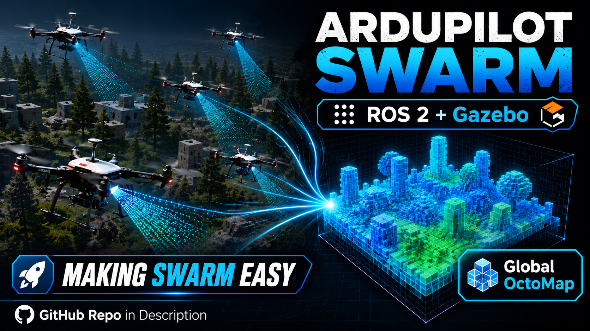
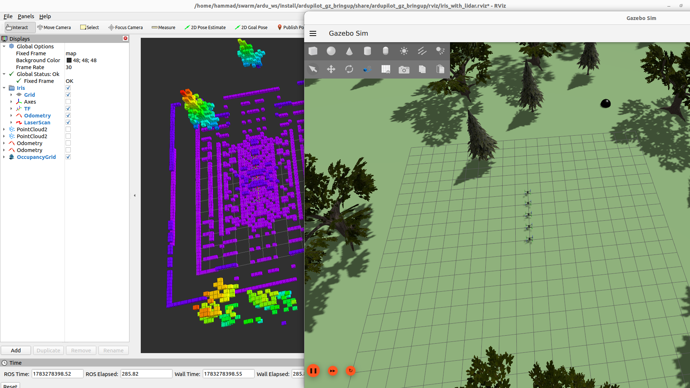

# ArduPilot Swarm ROS 2 Gazebo Workspace

[](https://www.youtube.com/watch?v=mojc7Xz_36E)

This repository is a customized ROS 2 / Gazebo workspace based on the
ArduPilot ROS 2 setup. It is meant for simulating multiple Iris drones with
lidar in Gazebo, while keeping the standard ArduPilot ROS 2, SITL, DDS, and
Gazebo workflow.

Upstream setup references:

- https://ardupilot.org/dev/docs/ros2-install.html
- https://ardupilot.org/dev/docs/ros2-sitl.html
- https://ardupilot.org/dev/docs/ros2-gazebo.html

Follow those ArduPilot pages first for system dependencies, ROS 2 setup,
Micro XRCE-DDS Agent setup, and the normal colcon build environment. This
repository already contains the workspace source tree, so do not repeat
commands that clone or import the upstream repositories into `src/`.

For a longer command-by-command guide, see [docs/tutorial.md](docs/tutorial.md).

## What This Repo Adds

The upstream ArduPilot Gazebo launch flow is normally focused on one vehicle.
This workspace adds a multi-vehicle Iris lidar launch flow for swarm simulation.
Each vehicle gets its own namespace, SITL instance, DDS port, MAVLink ports,
Gazebo FDM port, model name, and ROS/Gazebo bridge topics.

Important packages:

- `src/ardupilot`: ArduPilot with ROS 2 SITL support.
- `src/ardupilot_gz`: ArduPilot Gazebo bringup, descriptions, applications, and worlds.
- `src/ardupilot_gazebo`: ArduPilot Gazebo plugin.
- `src/ros_gz`: ROS 2 Gazebo bridge packages.
- `src/misc_nodes`: helper nodes used by the workspace; build this package too.
- `src/octomap_builder`: launches one OctoMap server per drone lidar stream and
  merges the per-drone maps into one global OctoMap.

Micro XRCE-DDS Agent is expected to be installed by following the upstream
ArduPilot ROS 2 instructions; its generated source/build folders are not tracked
in this repository.

## Build

From the workspace root:

```bash
cd ~/ardu_ws
source /opt/ros/humble/setup.bash
cd src/ardupilot
./Tools/environment_install/install-prereqs-ubuntu.sh -y
cd ../..
rosdep update
rosdep install --from-paths src --ignore-src -y
sudo apt install -y ros-humble-octomap ros-humble-octomap-msgs ros-humble-octomap-server
colcon build --packages-up-to ardupilot_gz_bringup misc_nodes octomap_builder
source install/setup.bash
```

If your workspace path is different, replace `~/ardu_ws` with your local path.

## Run Multiple Iris Lidar Drones

Recommended basic command:

```bash
cd ~/ardu_ws
source /opt/ros/humble/setup.bash
source install/setup.bash
ros2 launch ardupilot_gz_bringup iris_forest.launch.py num_vehicles:=5
```

If your Gazebo GUI needs the NVIDIA GPU path, prefix the same launch command
with the rendering environment variables:

```bash
QT_QPA_PLATFORM=xcb \
__NV_PRIME_RENDER_OFFLOAD=1 \
__GLX_VENDOR_LIBRARY_NAME=nvidia \
__VK_LAYER_NV_optimus=NVIDIA_only \
LIBGL_ALWAYS_SOFTWARE=0 \
GZ_RENDER_ENGINE=ogre2 \
ros2 launch ardupilot_gz_bringup iris_forest.launch.py num_vehicles:=5
```

Use the plain command first. Add the GPU variables only when Gazebo graphics
select the wrong renderer or the GUI opens with rendering issues.

## Useful Launch Arguments

Common arguments for `iris_forest.launch.py`:

- `num_vehicles:=5`: number of Iris drones to start.
- `start_x:=-8.0`: X position of the first drone.
- `x_spacing:=1.5`: distance between drones along the X axis.
- `y:=0.0`, `z:=0.194923`: shared Y and Z starting position.
- `R:=0.0`, `P:=0.0`, `Y:=0.0`: initial roll, pitch, and yaw.
- `lidar_dim:=3`: use 3D lidar; set `2` for 2D lidar.
- `use_gz_tf:=true`: relay Gazebo TF topics into ROS 2 TF.

Example with spacing and a shifted start position:

```bash
ros2 launch ardupilot_gz_bringup iris_forest.launch.py \
  num_vehicles:=5 \
  start_x:=-8.0 \
  x_spacing:=2.0
```

## OctoMap Mapping

The `octomap_builder` package can run an `octomap_server_node` for each Iris
lidar topic and then merge those individual maps into one global map. The launch
file subscribes to topics such as `/iris1/cloud_in`, `/iris2/cloud_in`, and
publishes per-drone OctoMaps under each Iris namespace, plus a merged
`/global_octomap_full`.

Start the swarm first. Then open another sourced terminal and start the TF
helpers from `misc_nodes`:

```bash
ros2 launch misc_nodes tf_tree.launch.py num_vehicles:=5
```

This creates the transform tree needed by the mapping pipeline, including
`map -> irisN/odom` and `irisN/odom -> irisN/base_link` for each drone.

In a third sourced terminal, start the OctoMap nodes:

```bash
ros2 launch octomap_builder multi_octomap_with_merger.launch.py vehicle_count:=5
```

Set `num_vehicles` and `vehicle_count` to match the number of drones launched
with `iris_forest.launch.py`.

## Demo

A recorded setup demo showing the multi-drone simulation working and UAV control
through QGroundControl is available here:

https://www.youtube.com/watch?v=mojc7Xz_36E

## Working System Screenshot

The screenshot below shows the swarm running in Gazebo with RViz visualizing the
OctoMap output.



## Notes

- Build and runtime folders are intentionally not tracked.
- The repository is focused on the workspace `src/` tree and custom swarm work.
- Dependency origins are preserved through the package source layout and upstream
  ArduPilot documentation links.
